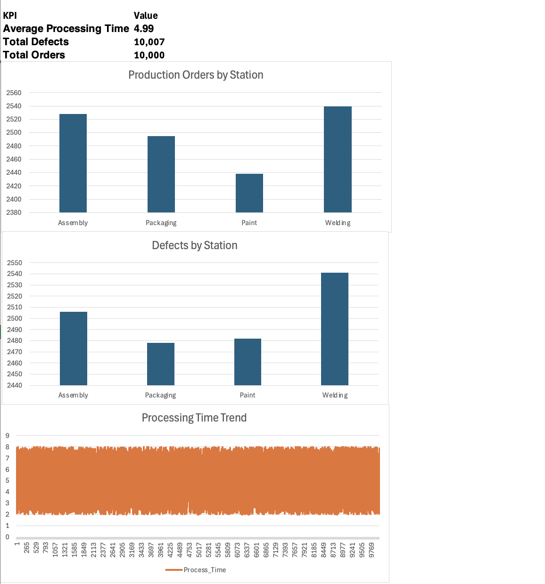

# Toyota Production Analytics Dashboard — Excel VBA Project

## Overview

This project demonstrates automation of manufacturing analytics using Excel VBA inspired by the Toyota Production System (TPS).

The dashboard processes simulated factory production data and automatically calculates key performance indicators (KPIs) used in Lean manufacturing and Six Sigma environments.

The system generates production orders, analyzes defect patterns, and visualizes factory performance through automated dashboards.

---

## Features

• Automated production data generation using VBA  
• Pareto defect analysis to identify top defect sources  
• KPI monitoring for factory performance  
• Monte Carlo simulation of production variability  
• Automated dashboard updates using VBA macros  

---

## Technologies

Excel  
VBA (Visual Basic for Applications)

---

## KPI Metrics

Average Processing Time = Total Processing Time / Orders  

Defect Rate = Total Defects / Total Orders  

Production Distribution = Orders by Station

Stations analyzed:

Assembly  
Packaging  
Paint  
Welding

---

## Use Case 

This automation simulates analytics workflows used in manufacturing environments such as those following the Toyota Production System.

Operations managers and engineers can use similar dashboards to monitor production efficiency, identify defect trends, and support continuous improvement initiatives.

The project demonstrates how Excel and VBA can be used to build lightweight analytics tools for factory operations and Lean manufacturing analysis.

